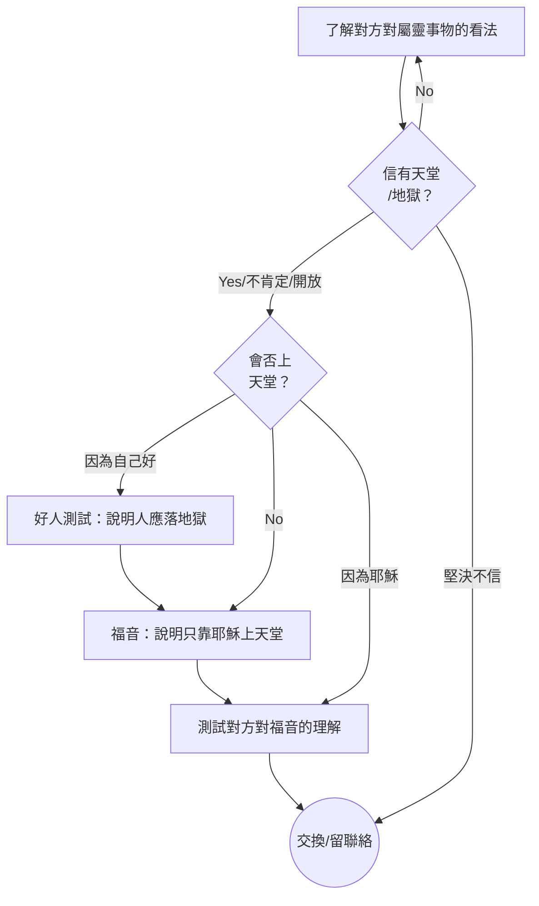

# 傳福音流程

## Flow Chart

## 詳細步驟
[詳細步驟](https://gist.github.com/KenHung/94a9b93ded2acff3f7eb453338e17a68#file-script-md)

# 各步驟精要
## 了解對方對屬靈事物的看法
### 主要目的：初步了解和計劃怎傳福音，引導對方思考天堂/地獄

✅你覺得人死咗之後會點？  
✅你信唔信有天堂/地獄？（如果唔想提「死」字）  
✅你信唔信有神？  
❌挪亞方舟（太間接，和天堂/地獄關係較少）  

## 好人測試
### 中心信息：人都有罪，應該落地獄作為懲罰

### 反對一：我冇殺人/我嘅罪冇咁嚴重到落地獄
* 亂拋垃圾就會被罰，無論你有冇犯其他罪；得罪神也是如此

### 反對二：人人都有犯罪
* 就算人人亂拋垃圾，唔代表你可以免罪

### 反對三：我做好事多過壞事
* 如果你捐款做慈善，能否免去亂拋垃圾的罰款？

### 反對四：我唔覺得自己有錯
* 在別人的家中需要遵循規則，否則就得罪別人；創造宇宙的神也有權設定祂的規則，不遵守祂的規則就是得罪神

## 福音
### 中心信息：
- 我們的罪需要耶穌承擔，就像罰單需要有人來支付
- 不知明天如何，要盡快信福音

### 反對一：想自己承擔刑罰
* 如果你亂過馬路而被車撞，你不會拒絕救護車的幫助；同樣，你也不應拒絕耶穌的幫助

### 誤解一：上天堂要尋求原諒
* 犯罪後向法官尋求原諒也不能免罪，神也不會輕易原諒

### 誤解二：不明白恩典
* 如果你幫我買外賣，得到$20，這叫報酬，不是恩典；神的救恩係白白的，不需要我們做事

### 誤解三：相信耶穌存在就足夠
* 只相信降落傘的存在不夠，你必須信任並使用它；救贖同樣需要信靠耶穌，不能單單相信耶穌存在

# 測試對方對福音的理解
- 點解你覺得自己可以上天堂？
- 如果你信耶穌之後，聽日犯咗五樣罪，然後死咗，咁最後會去邊？
- 做好事可唔可以令你上天堂？
- 如果100分滿分，你有幾肯定你可以上天堂？
- 如果神問你：點解我要俾你入天堂，你會點答？

# Tips
- 不要只是單方面講，對方不明白福音，就無法相信
- 盡量不要使用基督徒術語：得救、火湖、救恩、悔改、信靠主、任何聖經人物、任何聖經書卷⋯⋯
- 最少問一個問題測試對方對福音的理解

# 參考
- [needgod.net Gospel Conversations Script](https://www.needgod.net/script)
- [Common Analogies for Gospel Conversations](https://www.youtube.com/watch?v=mPTVgRuKj60)
